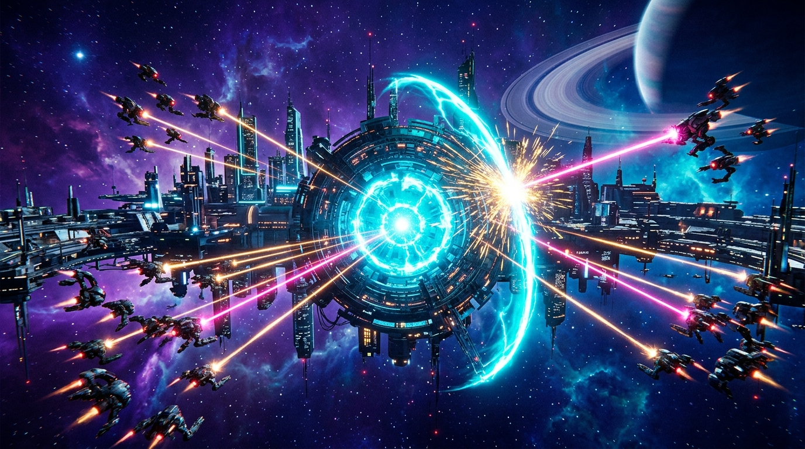

# Laser Ricochet: Blade Deflector 🛡️⚡

An intense neo-arcade reflex action game designed for web and mobile browsers. Defend the central Quantum Core aboard the Citadel Orbital Station by intercepting, angling, and reflecting enemy laser barrages back at hostile drone fleets!

---

## 🌟 Key Features

- **Orbital 1:1 Precision Control:** Seamless polar tracking on desktop with mouse and relative horizontal touchpad drag on mobile ( > 270\text{px}$) to eliminate hand blind spots.
- **Angular Slicing:** Dynamic reflection angles based on impact position along the crescent blade. Center hits bounce straight; edge slices deflect at sharp angles ($\pm 55^\circ$) for offensive aiming.
- **Perfect Parry Mechanic (160ms Window):** Tap or click at the exact frame of laser impact to trigger a high-velocity 1.45x counter-attack with hitstop, screen shake, and harmonic solar bursts.
- **Hangar Progression (5 Specialized Blades):**
  - **Pulse Deflector** (Standard Fleet Balanced)
  - **Titan Crimson** (+15% Reach / Heavy Alloy)
  - **Quantum Gold** (High-Luminosity Solar Flare)
  - **Nova Frost** (Glacial Cryo-Plasma)
  - **Vortex Void** (Gravitational Singularity)
  - *Strict Zero Pay-to-Win:* All blades share the exact same 160ms parry window!
- **Mini-Rogue Intermissions (Waves 3, 6, 9...):** Tactical battle-upgrade cards chosen during 10% Bullet-Time with an 8-second auto-select timer.
- **Single-Run Micro-Quests:** Dynamic challenges offering instant in-game gratification and plasma fragment rewards (+30 to +45 💎).
- **Periodic Dreadnought Bosses:** Multi-phase capital ships appearing every 5 waves with rotating attack patterns, holographic shield barriers, and counterable Mega-Beam attacks.
- **Adaptive Procedural Audio (Zero Asset Bloat):** Dynamic 120/138 BPM synthwave and dark industrial soundtracks synthesized in real time via native Web Audio API — 0 external audio files!
- **Global i18n:** English default with automatic browser language detection (Portuguese fallback) and live 🌐 EN / 🌐 PT toggle.

---

## 🎮 Controls

### Desktop (Mouse & Keyboard)
- **Mouse Move:** Move deflector blade along the orbital defense rail (1:1 polar tracking).
- **Left Click / Spacebar:** Trigger Perfect Parry on laser contact.
- **[P] / [ESC]:** Pause / Resume game.
- **[M]:** Toggle Audio Mute.
- **[H]:** Open Tactical Manual / Guide.
- **[R]:** Quick restart on Game Over.

### Mobile & Tablet (Touch)
- **Bottom Touchpad (drag horizontally in lower half):** Smooth relative rotation without covering the screen.
- **Tap Screen:** Trigger Parry on impact.
- **Interactive UI:** Large touch targets for Hangar, Modifiers, and Modals.

---

## 🛠️ Tech Stack & Architecture

- **Engine:** Phaser 3.88+
- **Language:** TypeScript 5+
- **Bundler:** Vite 5
- **Audio:** Native Web Audio API (Multi-bus architecture with master, sfx, and bgm nodes)
- **Rendering:** Decoupled modular pipelines (src/rendering/) with pre-baked off-screen textures (0ms background cost)
- **Garbage Collection:** Static pre-allocated pools for floating combat texts and Bezier currency particles (Zero-GC 60 FPS)
- **Platform Compliance:** Poki SDK v2 (Strict lifecycle order, ad muting, incognito persistence fallback, zero external requests, and scroll prevention)

---

## 🚀 Getting Started Locally

### Prerequisites
- [Node.js](https://nodejs.org/) (v18 or higher recommended)
- 
pm or pnpm

### Installation & Run

1. Clone the repository:
   `ash
   git clone https://github.com/CharlesPaim/Laser-Ricochet.git
   cd Laser-Ricochet
   `

2. Install dependencies:
   `ash
   npm install
   `

3. Start development server:
   `ash
   npm run dev
   `
   Open http://localhost:5173 in your browser.

4. Build for production:
   `ash
   npm run build
   `
   The compiled, minified bundle will be generated in dist/ (~372 KB gzipped).

---

## 📄 License

This project is licensed under the MIT License — see the [LICENSE](LICENSE) file for details.

Developed with ❤️ by **Charles Paim**.
